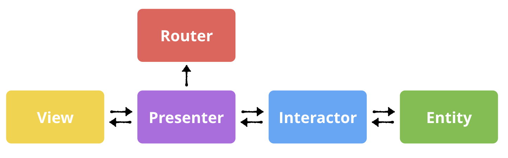

Understand the code structure
------------------------------

The design of this project loosely follows the VIPER architecture.
Most interesting parts lie inside package folder.

* View
    View_controller module controls the event listener for each
    widget on GUI.

* Presenter
    Presenter module is in charge of what will be presented on GUI,
    all plotting functions are defined here.

* Interactor and router
    Interactor and router act as a transmission buffer zone between
    entity and presenter.

* Entity
    Entity is responsible for backend data processing. For example,
    data recording module is in the hardware.py inside entity. Other
    computational heavy util functions are also put here.
    Variables.py consist lots of get and set functions for common variables
    used in presenter and view module. In the future, online decoding
    machine learing algorithms can also be added here.